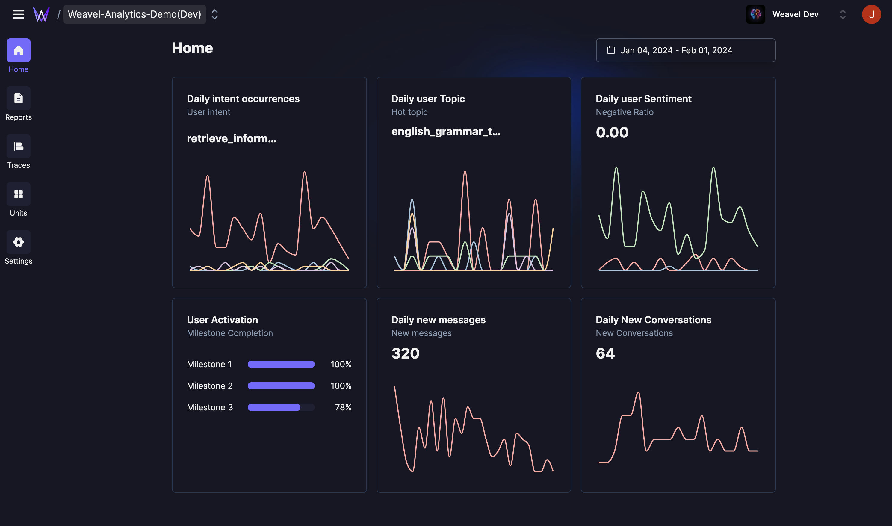
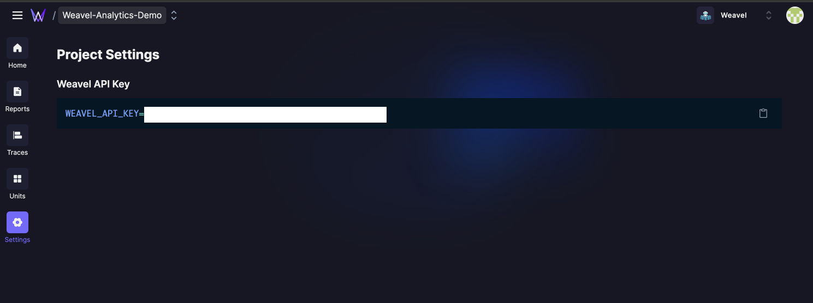

# Weavel Analytic for Poe Server bot

[Weavel Analytics](https://analytics.weavel.ai) is a product analytics tool for Conversation UI products.

The Weavel Analytics dashboard offers automated analysis of users' sentiment, interests, and the journey users undertake during conversations with the chatbot.



For more in-depth insights, the report tab provides detailed analytics, including retention metrics per topic and user journey maps in the conversation.


## How to Integrate

### 1. Get API Key



You can get your API key from project's setting page in dashboard.

### 2. Intergrate to your Server Bot

- Intergrate with fastapi_poe library

1. Set `.env` file like this.

    ```python
    WEAVEL_API_KEY=yOuR_aPi_KeY
    ```

2. Add logging code in your poe chatbot.
  
    ```python
    from weavel import create_poe_client # ADD THIS LINE

    weavel = create_poe_client() # ADD THIS LINE

    class GPT35TurboAllCapsBot(fp.PoeBot):
        async def get_response(
            self, request: fp.QueryRequest
        ) -> AsyncIterable[fp.PartialResponse]:
            responses = [] # ADD THIS LINE
            async for msg in fp.stream_request(
                request, "GPT-3.5-Turbo", request.access_key
            ):
                yield msg.model_copy(update={"text": msg.text})
                responses.append(msg) # ADD THIS LINE
            weavel.log(request, responses) # ADD THIS LINE
    ```


- (Optional) Integreate with modal deployment

1. Add Secret Key in Modal
    Follow this : [Modal Secrets](https://modal.com/docs/guide/secrets)

2. Add Integration code in modal app

    ```python
    REQUIREMENTS = ["fastapi-poe==0.0.24", "weavel>=0.0.7"] # ADD "weavel>=0.0.7"
    image = Image.debian_slim().pip_install(*REQUIREMENTS) 
    stub = Stub("turbo-allcaps-poe")

    @stub.function(
        image=image, 
        secrets=[
            modal.Secret.from_name("POE_ACCESS_KEY"),
            modal.Secret.from_name("WEAVEL_API_KEY"), # ADD WEAVEL_API_KEY in modal.com secrets or .env file
        ]
    )
    @asgi_app()
    def fastapi_app():
        ...
    ```

You can find the example code integration in file `poe_bot.py`.

## Pricing

Weavel Analytics is currently available for free. If you are interested in our PRO Plan, please feel free to contact us.

## Privacy Policy

You can find our privacy policy here. : [Privacy Policy](https://weavel.ai/privacy-policy)

## Question / Feedback

We welcome any questions or feedback you may have. Feel free to reach out to us via email at contact@promptmodel.run.